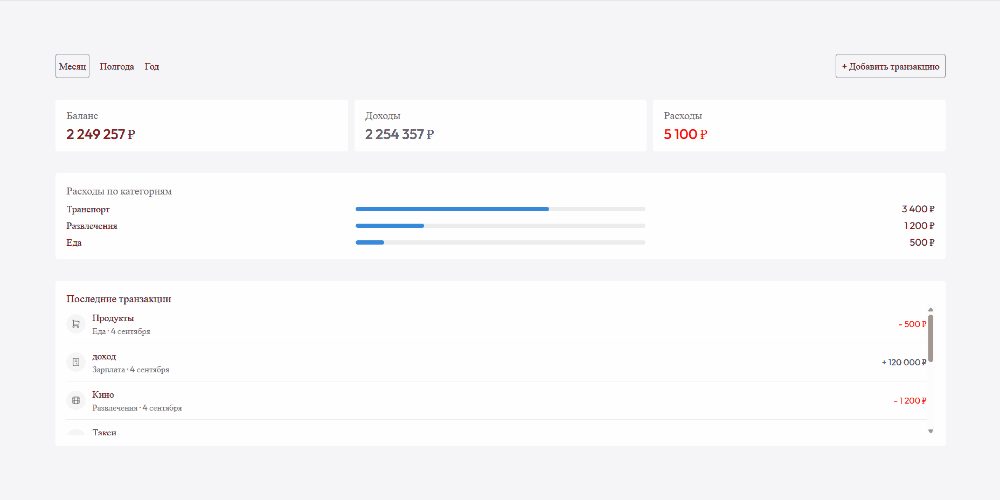

# Finance Tracker

Веб-приложение для учёта личных финансов: добавление доходов/расходов, статистика по балансу и расходам по категориям, фильтрация по периоду.

Репозиторий содержит два варианта одного и того же фронтенда:

- **`main`** — данные хранятся и обрабатываются полностью на клиенте: транзакции лежат в Redux-сторе (`transactionsSlice`), статистика считается селекторами (`statsSelectors.ts`). Без сервера.
- **`backend`** — тот же фронтенд, переведённый на работу с REST API через RTK Query (`api/apiSlice.ts`): транзакции и статистика приходят с сервера, а не считаются локально. Бэкенд (`server/`, Express + Prisma) написан не мной — я адаптировал фронтенд под уже готовый контракт API, как если бы это делала отдельная бэкенд-команда.

## **Запуск демо**
> Перейти по ссылке: https://tracking-financer.netlify.app/

## Функционал

- Добавление транзакции (доход/расход) через модальную форму с валидацией (react-hook-form + yup).
- Список последних транзакций с категорией, датой и суммой.
- Сводка по балансу, доходам и расходам.
- Расходы по категориям с процентным соотношением от общей суммы расходов.
- Фильтр по периоду: месяц / полгода / год — влияет сразу на все блоки со статистикой и списком транзакций.
- Уведомления (toast) об успешном/неуспешном добавлении транзакции.
- Адаптивная вёрстка.

## Стек

- React 19 + TypeScript, Vite
- Redux Toolkit (`createEntityAdapter`, `createSelector`) — хранение транзакций и вычисление статистики на клиенте
- React Hook Form + Yup (валидация формы)
- ESLint


## Локальный запуск

```bash
cd finance
npm install
npm run dev              # http://localhost:5173
```

Подробности — в [`finance/README.md`](finance/README.md).

## Демонстрация работы приложения
